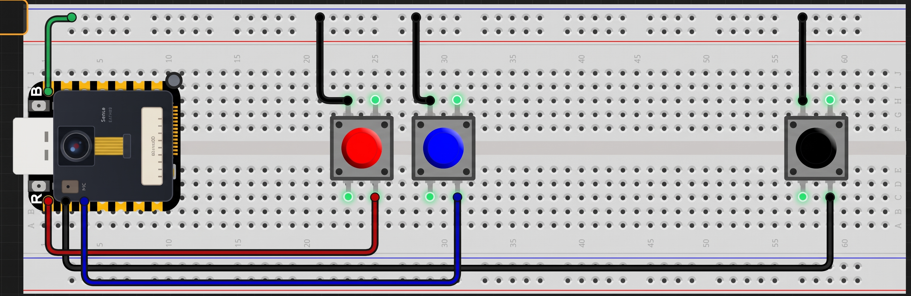

# MECT Hardware Assembly

The Multisensory Experience Capture Tool (MECT) capture device is a breadboard prototype built around the Seeed Studio XIAO ESP32S3 Sense. Its onboard camera and microphone record participant-selected moments to a microSD card. Three physical buttons provide the capture controls.

A breadboard holds parts and connects certain groups of holes internally, allowing the board, buttons, and jumper wires to connect without soldering. The image is a visual assembly reference; it does not label the button functions. Use the wiring table below for the pin mapping.

## Bill of Materials

- Seeed Studio XIAO ESP32S3 Sense with onboard camera, microphone, and microSD interface.
- Breadboard.
- Three normally-open momentary push buttons.
- Jumper wires.
- 32 GB microSD card, the tested capacity. The firmware requires a card it can read and write; no filesystem format is specified here.
- USB-C cable for computer connection and firmware upload.
- USB power bank, the tested field-power method, connected to the board's USB-C port.
- Computer for firmware setup/upload and running the MECT web application.
- microSD card reader or adapter if using file import or inspecting card contents on the computer.

No finalized PCB or reproducible enclosure design is provided in this repository. These instructions document the breadboard assembly used as the hardware reference.

## Button Wiring

Each button is a normally-open momentary switch: it connects its two contacts only while pressed. Wire one contact to the specified XIAO D pin and the other contact to GND.

| Control | XIAO pin | Connection when pressed | Function |
| --- | --- | --- | --- |
| Photo | D0 | D0 connects to GND | Captures one JPEG photo when possible. |
| End session | D1 | D1 connects to GND | Finalizes active audio and writes `session.json`. |
| Audio start/stop | D2 | D2 connects to GND | Starts an audio recording; the next press stops and saves it. |

The firmware configures all three pins as `INPUT_PULLUP`. In plain language, the board holds each input high internally until a pressed button connects it to ground, making the input go LOW. The current firmware needs no external pull-up resistors. Do not connect a button to 3.3 V.

## Breadboard Assembly

Assemble the device while it is disconnected from USB and the power bank.

1. Place the XIAO ESP32S3 Sense and three push buttons on the breadboard. Arrange them so that each button's two switch contacts connect to separate breadboard contact groups when the button is not pressed. Breadboard hole connections differ by row and rail; check the board's markings and contact layout rather than assuming neighboring holes are isolated.
2. Connect one contact of the photo button to XIAO pin D0. Connect its other contact to a GND connection on the XIAO.
3. Connect one contact of the end-session button to D1 and its other contact to GND.
4. Connect one contact of the audio button to D2 and its other contact to GND.
5. If using a shared breadboard ground row, connect that row to XIAO GND and connect each button's ground-side contact to the same electrically continuous row.
6. Check that no button contact accidentally bridges its D pin directly to GND except when pressed, and that no button is wired to 3.3 V. No external resistors are required for these button inputs.

The image does not identify which visible button is assigned to each action. Confirm the mapping from this table and the functional test below, not from button color or image position.

## Insert the microSD Card

With the device unpowered, insert the tested 32 GB microSD card into the XIAO ESP32S3 Sense's onboard card slot. Follow the slot's physical orientation and do not force the card. The firmware does not specify a filesystem format. During first-time setup, verify that the card initializes and passes the firmware's write/read test before field use.

## Connect and Power the Device

For firmware upload, connect the board's USB-C port to the computer using the USB-C cable. For field use, the tested method is a standard USB power bank connected to the same USB-C port. This guide does not prescribe or verify direct battery wiring, other board power pins, or other battery arrangements.

## First Power-On Checks

1. Connect the USB-C cable to the computer and open the serial monitor at **115200 baud**.
2. Read the startup output. Confirm the SD card is detected and the test completes with `SD_TEST_SUCCESS`.
3. Confirm the camera reports `Camera initialized.`
4. Confirm the buttons report `Buttons initialized.`
5. Do not use the final `Device ready.` line by itself as proof that initialization succeeded. Stop and troubleshoot if the SD test, camera, or button initialization reports failure.
6. The microphone is not initialized at boot. Its setup is attempted the first time audio recording is started; verify it with a test recording.

## Basic Functional Test

1. Press the photo button once. The serial monitor should report a successful photo capture, and a file such as `IMG_0001.JPG` should be written to the microSD card. The number may differ if files already exist.
2. Press the audio button to start a recording. Confirm the serial monitor reports `AUDIO_RECORDING_STARTED`.
3. Press the audio button again to stop. Confirm `AUDIO_RECORDING_STOPPED` and a WAV file such as `AUD_0001.WAV` on the card.
4. Press the end-session button. Wait for `SESSION_SAVED` in the serial output. `session.json` should list the registered captures and refer to their media filenames.
5. Power off before removing the card to inspect the manifest and media. The device can also transfer the session over BLE after the manifest is saved.

Photos are ignored while an audio recording is active. The session manifest can register up to 50 captures total.

## Common Assembly Problems

- **A button press is not detected:** Check that one contact reaches its assigned D pin and the other reaches GND, and that the button contacts are not placed in the same internally connected breadboard group. A very brief tap may not register reliably because the firmware filters contact changes for about 50 ms.
- **The SD startup test fails:** Power off, check that the card is fully inserted, and retry with the tested 32 GB card. The repository does not specify a card format; verify readable/writable initialization rather than guessing a format.
- **The camera does not initialize or save a photo:** Check the camera initialization message and repeat the test with the device powered and the SD card passing its write/read test.
- **Audio does not start:** Confirm the SD startup test passed, then check serial output when pressing Audio. Microphone setup happens on the first recording attempt, not at boot.
- **The board does not connect for upload:** Confirm the USB-C cable connects to the board's USB-C port and supports data transfer. Recheck the selected PlatformIO environment and upload output.

For software setup and the complete first-run sequence, see [Getting Started](GETTING_STARTED.md). For study operation, see the [Usage Guide](USAGE_GUIDE.md).
